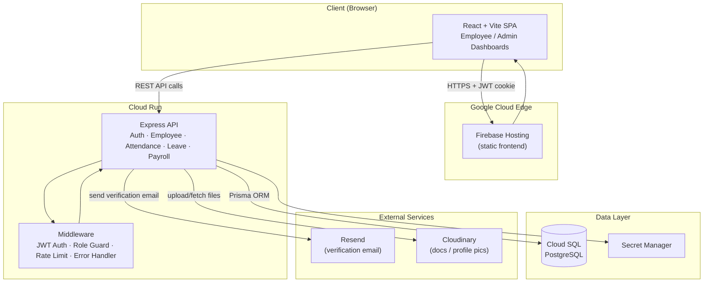
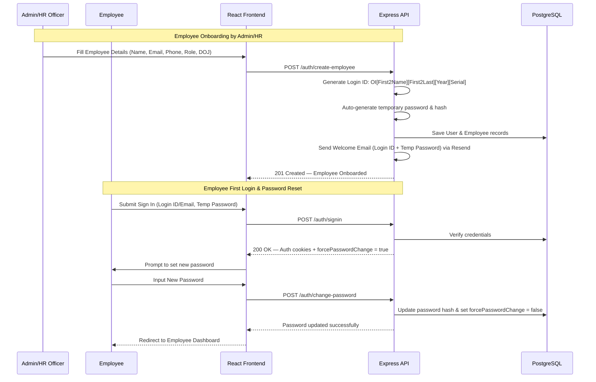
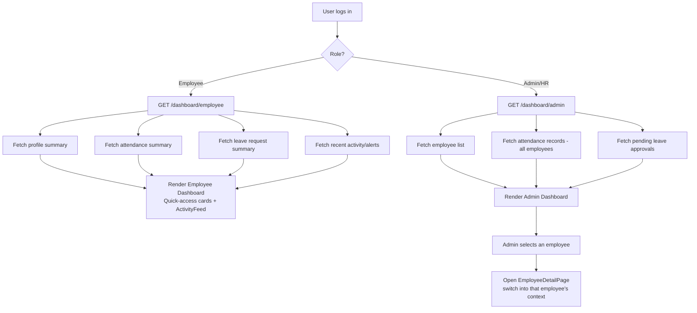
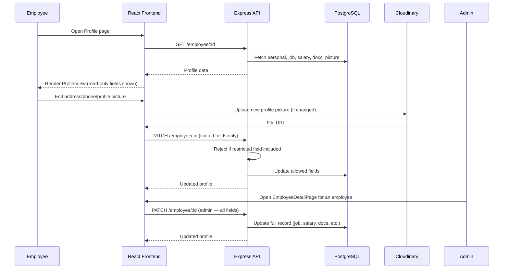
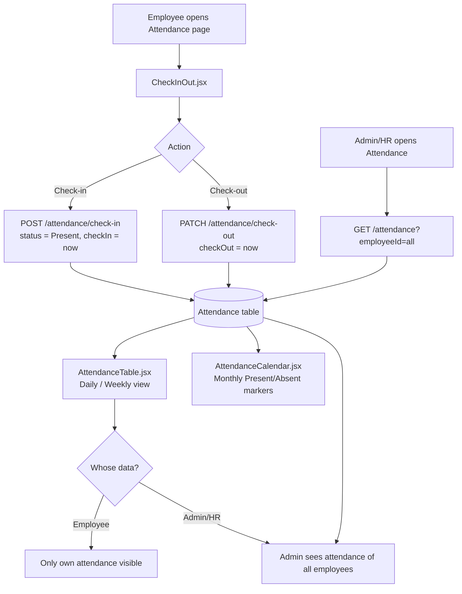
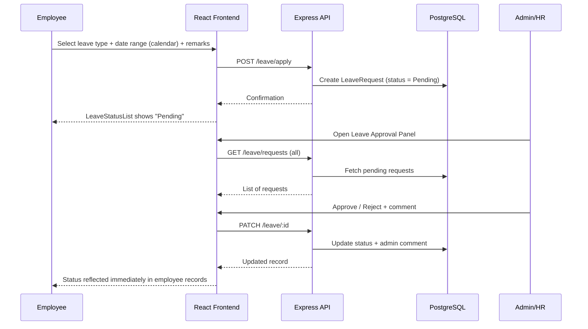
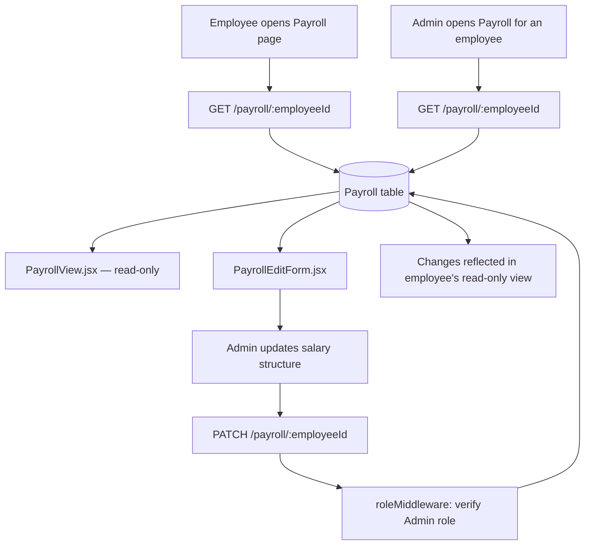
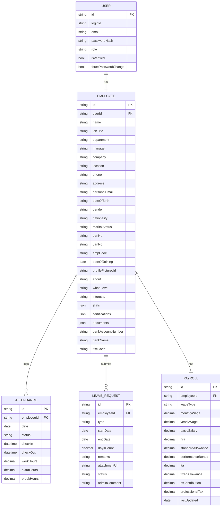

# Human Resource Management System (HRMS)
### Full System Design, Folder Structure & Tech Stack

*Every workday, perfectly aligned.*

---

## 1. Introduction

### 1.1 Purpose
The purpose of this document is to define the functional and non-functional requirements of a Human Resource Management System (HRMS). The system aims to digitize and streamline core HR operations such as employee onboarding, profile management, attendance tracking, leave management, payroll visibility, and approval workflows for admins and HR officers.

### 1.2 Scope
The HRMS will provide:
- Secure authentication (Sign Up / Sign In)
- Role-based access (Admin vs Employee)
- Employee profile management
- Attendance tracking (daily/weekly view)
- Leave and time-off management
- Approval workflows for HR/Admin

### 1.3 Definitions & Abbreviations
- **Admin / HR Officer**: User with management and approval privileges
- **Employee**: Regular user with limited access
- **Time-Off**: Paid leave, sick leave, unpaid leave, etc.

---

## 2. User Classes and Characteristics

| User Type | Description |
|---|---|
| Admin / HR Officer | Manages employees, approves leave & attendance, views payroll details |
| Employee | Views personal profile, attendance, applies for leave, views salary details |

---

## 3. Functional Requirements

### 3.1 Authentication & Authorization

**3.1.1 Employee Onboarding & Sign Up**
- **Admin/HR Onboarding**: Regular users cannot register themselves. Only the Admin or HR Officer can create new employee profiles.
- **Login ID Generation**: When a profile is created, the system auto-generates a unique Login ID in the format:
  `OI` + `[First 2 letters of first name]` + `[First 2 letters of last name]` + `[Year of joining]` + `[4-digit serial number]`
  *Example*: `OIJODO20220001` (OI -> Odoo India; JODO -> Jo[hn] Do[e]; 2022 -> Year of Joining; 0001 -> Serial Number).
- **Temporary Password**: The system auto-generates a temporary password for the new employee upon creation.
- **First-Time Sign In**: Employees can sign in using their Login ID (or email) and the temporary password, and are prompted to change their password on first login.
- **Sign Up Page**: (For Admin/HR) Fields include Name, Email, Phone, Password, Confirm Password, and Upload Logo.

**3.1.2 Sign In**
- Users (Employees & Admins) sign in using their Login ID (or Email) and Password.
- Incorrect credentials display clear error messages.
- Redirects to the dashboard on success.

### 3.2 Navigation & Dashboard

**3.2.1 Navigation Layout**
- **Sidebar**: Employees, Attendance, Time Off, Settings, Log Out.
- **Header**: Company Logo, Company Name, User Profile Avatar.
- **Avatar Dropdown**: Clicking the avatar opens a dropdown with "My Profile" and "Log Out".

**3.2.2 Employee Card Grid & Status Indicators**
- **Dashboard View**: Grid of clickable cards for all employees.
- **Card Display**: Displays employee name, profile picture/avatar, and basic info.
- **Click Behavior**: Clicking an employee card opens their profile page in a **view-only (non-editable)** mode.
- **Work Status Dots**: Located at the top-right corner of each card:
  - 🟢 **Green dot**: Employee is checked in and present in the office.
  - ✈️ **Airplane icon**: Employee is on approved leave.
  - 🟡 **Yellow dot**: Employee is absent (has not checked in and has no approved leave).

### 3.3 Employee Profile Management

**3.3.1 Profile View Tabs**
- **My Profile** (Form View): Accessible from the avatar dropdown or card click.
  - **Employee Info**: Profile Picture, Name, Mobile, Email, Department, Job Position, Manager, Company, Location, Date of Joining, Employee Code.
  - **About**: "About me", "What I love about my job", "My interests and hobbies".
  - **Skills & Certifications**: Resume attachment, Skills list (+ Add Skills button), Certification list.
- **Private Info** (Personal details):
  - Date of Birth, Residing Address, Personal Email, Gender, Nationality, Marital Status.
  - PAN No, UAN No, Emp Code.
- **Bank Details**:
  - Account Number, Bank Name, IFSC Code.
- **Salary Info** (Visible ONLY to Admin; hidden or restricted for regular employees).

**3.3.2 Edit Profile**
- Employees can edit personal fields (e.g. address, phone, avatar, about text, skills).
- Admins/HR can view and edit all fields, including job, database identifiers, and salary information.

### 3.4 Attendance Management

**3.4.1 Attendance Tracking**
- **Systray Widget**: Quick Check In / Check Out buttons in the header/systray.
- **Check In Trigger**: Successful Check In changes the status dot from red/yellow to green.
- **Employee View**: Day-wise grid/calendar for the ongoing month showing Date, Day, Check In time, Check Out time, Work Hours, Extra Hours, and Breaks.
- **Admin/HR View**: Monitor real-time status of all employees present on the current day.

**3.4.2 Payroll Integration**
- Attendance records form the basis for monthly payslip generation.
- The system automatically calculates total payable days. Missing check-ins (unexcused absences) or unpaid leaves reduce the payable days count.

### 3.5 Leave & Time-Off Management

**3.5.1 Apply for Leave (Employee)**
- **Leave Request**: Form includes:
  - Time Off Type: Paid Time Off (24 days allocation), Sick Leave (7 days allocation), Unpaid Leaves.
  - Validity Period: From and To date fields selected directly on a calendar.
  - Attachment: Mandatory for Sick Leave (medical certificate upload).
  - Remarks: text description.
  - Days Count: auto-calculated requested days.
- **Status Workflow**: Pending (default) ➔ Approved / Rejected.
- **Calendar Marker**: Approved leaves show as an Airplane icon on the employee card and are logged in their attendance calendar.

**3.5.2 Leave Approvals**
- Employees can view and manage only their own requests.
- Admins and HR Officers can view, approve, or reject leave requests for all employees, and add comments.

### 3.6 Payroll & Salary Management

**3.6.1 Access Rights**
- **Employee**: Can view their own salary structure in a read-only tab.
- **Admin**: Can view, configure, and edit payroll details for all employees.

**3.6.2 Salary Components Auto-Calculator**
Admin configures the **Monthly Wage** (Fixed wage) which automatically calculates the following salary components:
- **Basic Salary**: 50% of Monthly Wage.
- **House Rent Allowance (HRA)**: 50% of Basic Salary (i.e. 25% of Monthly Wage).
- **Standard Allowance**: ₹4,167 (fixed amount).
- **Performance Bonus**: 8.33% of Basic Salary.
- **Leave Travel Allowance (LTA)**: 8.333% of Basic Salary.
- **Fixed Allowance**: `Monthly Wage` - `Sum of all other components` (recalculates to balance).
*Rule*: The total sum of all components must equal the defined Monthly Wage.
- **Tax & Deductions**:
  - **Provident Fund (PF) Contribution**: 12% of Basic Salary.
  - **Professional Tax (PT)**: ₹200 (deducted from Gross Salary).

**Reference wireframe**: [Excalidraw](https://excalidraw.com/#json=_0coSR1KpTC1CzrFe7yIo,wvy6Mpyg1XFGcYEwE69N_A)

---

## 4. System Design Diagrams

### 4.1 High-Level Architecture



### 4.2 Authentication Flow (3.1)



### 4.3 Dashboard Load Flow (3.2)



### 4.4 Profile Management Flow (3.3)



### 4.5 Attendance Flow (3.4)



### 4.6 Leave Request & Approval Flow (3.5)



### 4.7 Payroll Flow (3.6)



### 4.8 Entity Relationship (Data Model)



---

## 5. Folder Structure

```
hrms/
├── client/                 # React + Vite frontend
├── server/                 # Node + Express backend
├── .gitignore
├── README.md
└── docs/
    └── SRS_HRMS.pdf

client/
├── public/
│   └── favicon.ico
├── src/
│   ├── assets/
│   │   ├── images/
│   │   └── icons/
│   ├── components/
│   │   ├── common/
│   │   │   ├── Button.jsx
│   │   │   ├── Input.jsx
│   │   │   ├── Modal.jsx
│   │   │   ├── Card.jsx
│   │   │   ├── Loader.jsx
│   │   │   ├── EmptyState.jsx           # no-data states (no leaves, no docs, etc.)
│   │   │   └── Navbar.jsx
│   │   ├── auth/
│   │   │   ├── SignUpForm.jsx           # Name, Email, Phone, Role, DOJ (onboarding by Admin/HR) (3.1.1)
│   │   │   ├── SignInForm.jsx           # (3.1.2)
│   │   │   ├── VerifyEmailNotice.jsx    # email verification (3.1.1)
│   │   │   └── PasswordRulesHint.jsx    # live password policy validation (3.1.1)
│   │   ├── dashboard/
│   │   │   ├── EmployeeDashboard.jsx    # quick-access cards (3.2.1)
│   │   │   ├── AdminDashboard.jsx       # employee list, records, approvals (3.2.2)
│   │   │   ├── QuickAccessCard.jsx      # Profile / Attendance / Leave / Logout
│   │   │   └── ActivityFeed.jsx         # "recent activity / alerts" (3.2.1)
│   │   ├── profile/
│   │   │   ├── ProfileView.jsx          # personal, job, salary, docs, picture (3.3.1)
│   │   │   ├── ProfileEdit.jsx          # employee: limited fields; admin: all (3.3.2)
│   │   │   └── DocumentUpload.jsx
│   │   ├── attendance/
│   │   │   ├── AttendanceCalendar.jsx   # monthly view, Present/Absent markers (3.5.1)
│   │   │   ├── CheckInOut.jsx           # (3.4.1)
│   │   │   ├── AttendanceTable.jsx      # daily/weekly view (3.4.1)
│   │   │   └── AttendanceStatusBadge.jsx # Present / Absent / Half-day / Leave
│   │   ├── leave/
│   │   │   ├── LeaveApplyForm.jsx       # type, remarks (3.5.1)
│   │   │   ├── LeaveCalendarPicker.jsx  # direct date-range selection on calendar (3.5.1)
│   │   │   ├── LeaveStatusList.jsx      # Pending / Approved / Rejected (3.5.1)
│   │   │   └── LeaveApprovalPanel.jsx   # admin approve/reject + comments (3.5.2)
│   │   └── payroll/
│   │       ├── PayrollView.jsx          # read-only for employees (3.6.1)
│   │       └── PayrollEditForm.jsx      # admin: update salary structure (3.6.2)
│   ├── pages/
│   │   ├── SignUpPage.jsx           # Admin/HR onboarding interface
│   │   ├── SignInPage.jsx
│   │   ├── DashboardPage.jsx
│   │   ├── ProfilePage.jsx
│   │   ├── AttendancePage.jsx
│   │   ├── LeavePage.jsx
│   │   ├── PayrollPage.jsx
│   │   ├── EmployeeListPage.jsx         # Admin only — full employee list (3.2.2)
│   │   ├── EmployeeDetailPage.jsx       # Admin only — switch into a single employee's
│   │   │                                #   profile/attendance/leave/payroll (3.2.2)
│   │   └── NotFoundPage.jsx
│   ├── layouts/
│   │   ├── MainLayout.jsx
│   │   ├── AuthLayout.jsx
│   │   └── DashboardLayout.jsx
│   ├── routes/
│   │   ├── AppRoutes.jsx
│   │   ├── ProtectedRoute.jsx
│   │   └── AdminRoute.jsx
│   ├── context/
│   │   ├── AuthContext.jsx
│   │   └── UserContext.jsx
│   ├── hooks/
│   │   ├── useAuth.js
│   │   ├── useAttendance.js
│   │   ├── useLeave.js
│   │   └── usePayroll.js
│   ├── services/               # API calls
│   │   ├── api.js              # axios instance
│   │   ├── authService.js
│   │   ├── employeeService.js
│   │   ├── attendanceService.js
│   │   ├── leaveService.js
│   │   └── payrollService.js
│   ├── utils/
│   │   ├── validators.js       # password policy, email format, etc.
│   │   ├── dateHelpers.js
│   │   └── constants.js
│   ├── store/                  # if using Redux/Zustand instead of Context
│   │   └── index.js
│   ├── App.jsx
│   ├── main.jsx
│   └── index.css
├── .env
├── index.html
├── package.json
├── tailwind.config.js
├── postcss.config.js
└── vite.config.js

server/
├── src/
│   ├── config/
│   │   ├── db.js
│   │   ├── env.js
│   │   └── cloudinary.js
│   ├── models/
│   │   ├── User.js              # employeeId, email, password hash, role, isVerified
│   │   ├── Employee.js          # job details, salary structure, documents, profile pic
│   │   ├── Attendance.js        # date, status, check-in/out time
│   │   ├── LeaveRequest.js      # type, date range, remarks, status, admin comments
│   │   └── Payroll.js
│   ├── controllers/
│   │   ├── authController.js       # signup, signin, verify-email
│   │   ├── employeeController.js   # includes getEmployeeById for admin drill-in
│   │   ├── attendanceController.js
│   │   ├── leaveController.js
│   │   └── payrollController.js
│   ├── routes/
│   │   ├── authRoutes.js
│   │   ├── employeeRoutes.js
│   │   ├── attendanceRoutes.js
│   │   ├── leaveRoutes.js
│   │   └── payrollRoutes.js
│   ├── middleware/
│   │   ├── authMiddleware.js       # JWT verification
│   │   ├── roleMiddleware.js       # Admin vs Employee guard
│   │   ├── errorHandler.js
│   │   └── validateRequest.js
│   ├── services/
│   │   ├── emailService.js         # verification emails, password reset
│   │   └── tokenService.js
│   ├── utils/
│   │   ├── hashPassword.js
│   │   ├── generateToken.js
│   │   └── logger.js
│   ├── validators/
│   │   ├── authValidator.js        # password rules, employeeId/email format
│   │   ├── leaveValidator.js
│   │   └── profileValidator.js
│   ├── app.js
│   └── server.js
├── prisma/                     # if using Prisma + PostgreSQL
│   ├── schema.prisma
│   └── migrations/
├── .env
├── package.json
└── nodemon.json
```

---

## 6. Tech Stack

### 6.1 Frontend (`client/`)
| Layer | Tech |
|---|---|
| Framework | React 18 + Vite |
| Styling | Tailwind CSS |
| Routing | React Router v6 |
| Auth/global state | React Context API |
| Server-state/caching | TanStack Query |
| HTTP client | Axios |
| Forms + validation | React Hook Form + Zod |
| Calendar UI | react-day-picker / FullCalendar (drives attendance monthly view and leave date-range picker) |
| Icons | lucide-react |
| Toasts | react-hot-toast |

### 6.2 Backend (`server/`)
| Layer | Tech |
|---|---|
| Runtime | Node.js (LTS) + Express |
| ORM | Prisma |
| Database | PostgreSQL |
| Auth | JWT (access ~15min + refresh ~7day) in httpOnly cookies |
| Password hashing | bcrypt |
| Validation | Zod |
| Rate limiting | express-rate-limit (in-memory store) |
| Email | Resend (verification emails per 3.1.1) |
| File uploads | Multer + Cloudinary (documents + profile picture) |
| Logging | Pino |
| Security headers | Helmet |
| CORS | cors package |
| Error handling | Custom error classes + centralized errorHandler middleware |

### 6.3 Infra (Google Cloud)
| Concern | Service |
|---|---|
| API hosting | Cloud Run |
| Frontend hosting | Firebase Hosting |
| Database | Cloud SQL for PostgreSQL |
| Secrets | Secret Manager |
| CI/CD | Cloud Build or GitHub Actions → Cloud Run |
| Scheduled tasks (if ever needed) | Cloud Scheduler → Cloud Run endpoint |

### 6.4 Testing
| Layer | Tech |
|---|---|
| Backend | Jest + Supertest |
| Frontend | Vitest + React Testing Library |

### 6.5 Explicitly excluded
- No Redis (rate limiting done in-memory)
- No Celery/background workers (email sent inline; no queue needed for current workflows)
- No separate notifications microservice — dashboard "recent activity/alerts" (`ActivityFeed.jsx`) is derived on-the-fly from existing attendance/leave data, not a persisted notification model

---

## 7. Traceability Notes (SRS → Structure)

1. **`ActivityFeed.jsx`** (`components/dashboard/`) — implements the "recent activity or alerts" requirement from 3.2.1.
2. **`EmployeeDetailPage.jsx`** (`pages/`) — implements the admin ability to "switch between employees" from 3.2.2; backed by `getEmployeeById` in `employeeController.js`.
3. **`PasswordRulesHint.jsx`** (`components/auth/`) — surfaces the password security rules required in 3.1.1.
4. **`EmptyState.jsx`** (`components/common/`) — shared no-data state for Leave/Attendance/Documents views.
5. **`AttendanceCalendar.jsx`** and **`LeaveCalendarPicker.jsx`** together implement 3.5.1's monthly calendar with Present/Absent markers and direct date-range selection.
6. **`AttendanceStatusBadge.jsx`** enumerates the four status types from 3.4.1 (Present, Absent, Half-day, Leave).
7. **`PayrollView.jsx`** vs **`PayrollEditForm.jsx`** enforce the read-only-for-employee / editable-for-admin split from 3.6.
8. Role separation throughout (`AdminRoute.jsx`, `roleMiddleware.js`) enforces the Admin/HR vs Employee access model from Section 2.

Routing, middleware, services, infra, and testing stack all map cleanly onto the SRS scope and required no structural changes beyond the above.
